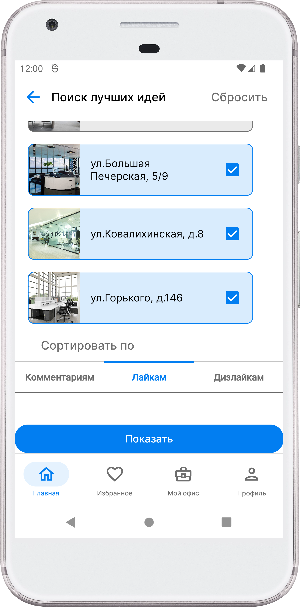
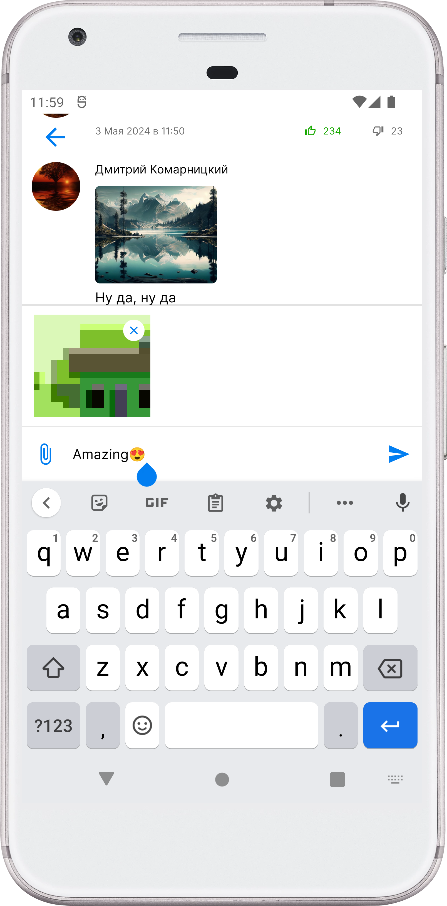
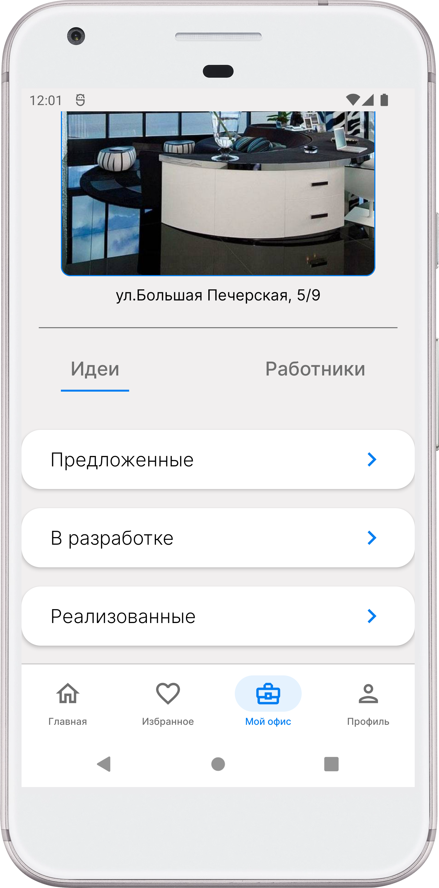

# Приложение с идеями по улучшению офисного пространства

Данное приложение может быть полезно для компаний, где имеется определенное множество офисов. Работники данной компании могут скачать приложение, зарегистрироваться, выбрать свой офис и вдохновляться идеями коллег или предлагать свои идеи, переносить понравившиеся идеи в свой офис и отслеживать прогресс реализации определенных улучшений в своем офисе.

# Основной функционал приложения

1) Лента с идеями пользователей приложения
2) Публикация и редактирование идей
3) Поиск подходящих идей
4) Комментирование
5) Отслеживание понравившхися идей
6) Предложение идей своему офису, отслеживание прогресса их реализации

# Скриншоты

## Главный экран

## Расширенная информация об идее

## Фильтры для идей

## Комментарии

## Понравившиеся идеи

## Офис пользователя

## Профиль пользователя

## Идеи пользователя

## Публикация идеи и редактирование

# Статус: 🚧 В разработке

Проект еще в процессе разработке, поэтому некоторый функционал еще не реализован.
